# USBIPD 多客户端架构流程图

## 1. 整体架构图

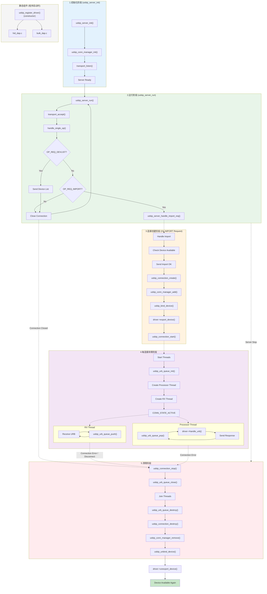

## 2. 服务器主循环流程

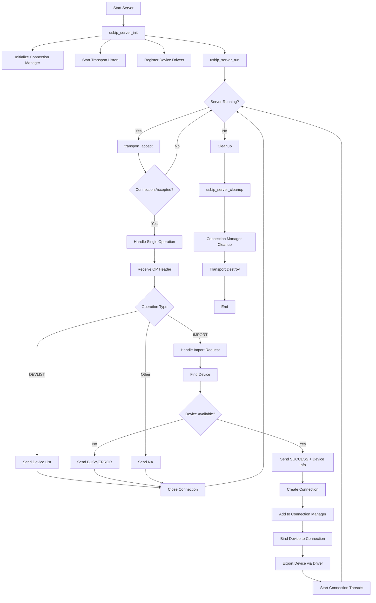

## 3. 连接生命周期流程

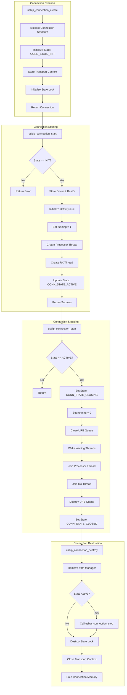

## 4. URB 处理流程（每连接）

```mermaid
flowchart TD
    subgraph RXThread["RX Thread (usbip_conn_rx_thread)"]
        R1[While running] --> R2[usbip_recv_header]
        R2 --> R3{Receive OK?}
        R3 -->|No| R_EXIT[Signal Stop]
        R3 -->|Yes| R4{Direction = OUT?}
        R4 -->|Yes| R5[Receive URB Data]
        R4 -->|No| R6[Data Len = 0]
        R5 --> R7[usbip_urb_queue_push]
        R6 --> R7
        R7 --> R8{Push OK?}
        R8 -->|No| R_EXIT
        R8 -->|Yes| R1
        R_EXIT --> R_CLOSE[Close URB Queue]
        R_CLOSE --> R_END[Thread Exit]
    end

    subgraph ProcessorThread["Processor Thread (usbip_conn_processor_thread)"]
        P1[While running] --> P2[usbip_urb_queue_pop]
        P2 --> P3{Pop OK?}
        P3 -->|No| P_EXIT[Thread Exit]
        P3 -->|Yes| P4[driver->handle_urb]
        P4 --> P5{Handle OK?}
        P5 -->|No| P_FREE[Free data_out]
        P5 -->|Yes| P6{Need Response?}
        P6 -->|Yes| P7[usbip_urb_send_reply]
        P6 -->|No| P8[Free data_out]
        P7 --> P8
        P_FREE --> P_EXIT
        P8 --> P1
    end

    subgraph URBQueue["URB Queue Operations"]
        Q1[Push] --> Q2{Queue Full?}
        Q2 -->|Yes| Q3[Wait on not_full]
        Q2 -->|No| Q4[Store URB in Slot]
        Q3 --> Q4
        Q4 --> Q5[Signal not_empty]
        
        Q6[Pop] --> Q7{Queue Empty?}
        Q7 -->|Yes| Q8[Wait on not_empty]
        Q7 -->|No| Q9[Retrieve URB from Slot]
        Q8 --> Q9
        Q9 --> Q10[Signal not_full]
        
        Q11[Close] --> Q12[Set closed = 1]
        Q12 --> Q13[Broadcast not_empty]
        Q12 --> Q14[Broadcast not_full]
    end
```

## 5. 设备管理流程

```mermaid
flowchart TD
    subgraph DriverRegistration["Driver Registration"]
        DR1[usbip_register_driver] --> DR2{Registry Full?}
        DR2 -->|Yes| DR_ERR[Return Error]
        DR2 -->|No| DR3{Already Registered?}
        DR3 -->|Yes| DR_ERR
        DR3 -->|No| DR4[Add to Registry]
        DR4 --> DR5[Call driver->init]
        DR5 --> DR6{Init OK?}
        DR6 -->|No| DR_ROLL[Remove from Registry]
        DR6 -->|Yes| DR_OK[Return Success]
        DR_ROLL --> DR_ERR
    end

    subgraph DeviceBinding["Device Binding"]
        DB1[usbip_bind_device] --> DB2[Check if Already Exported]
        DB2 --> DB3{Device Exists?}
        DB3 -->|Yes| DB4{State = EXPORTED?}
        DB4 -->|Yes| DB_ERR[Return -EBUSY]
        DB4 -->|No| DB5[Update Owner = conn]
        DB3 -->|No| DB6[Create New Entry]
        DB6 --> DB7[Set Owner = conn]
        DB7 --> DB8[Set State = EXPORTED]
        DB5 --> DB_OK[Return 0]
        DB8 --> DB_OK
    end

    subgraph DeviceUnbinding["Device Unbinding"]
        DU1[usbip_unbind_device] --> DU2[Find Device Entry]
        DU2 --> DU3{Found?}
        DU3 -->|No| DU_DONE[Return]
        DU3 -->|Yes| DU4[Set State = AVAILABLE]
        DU4 --> DU5[Set Owner = NULL]
        DU5 --> DU_DONE
    end

    subgraph DeviceEnumeration["Device Enumeration"]
        DE1[get_device_count] --> DE2[Iterate All Drivers]
        DE2 --> DE3{Device Busy?}
        DE3 -->|Yes| DE4[Skip]
        DE3 -->|No| DE5[Count++]
        
        DE6[get_device_by_index] --> DE7[Find Driver by Index]
        DE7 --> DE8{Device Busy?}
        DE8 -->|Yes| DE_ERR[Return -1]
        DE8 -->|No| DE_OK[Return Device Info]
    end
```

## 6. 多客户端并发架构

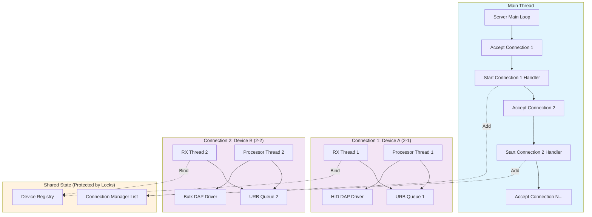

## 7. 错误处理和清理流程

```mermaid
flowchart TD
    subgraph ErrorHandling["Error Handling"]
        E1[Import Request] --> E2[Create Connection]
        E2 --> E3{Create OK?}
        E3 -->|No| E_FAIL1[Close Transport]
        E3 -->|Yes| E4[Add to Manager]
        E4 --> E5{Add OK?}
        E5 -->|No| E_FAIL2[Destroy Connection]
        E5 -->|Yes| E6[Bind Device]
        E6 --> E7{Bind OK?}
        E7 -->|No| E_FAIL3[Remove from Manager]
        E7 -->|Yes| E8[Export Device]
        E8 --> E9{Export OK?}
        E9 -->|No| E_FAIL4[Unbind Device]
        E9 -->|Yes| E10[Start Connection]
        E10 --> E11{Start OK?}
        E11 -->|No| E_FAIL5[Unexport + Unbind]
        E11 -->|Yes| E_SUCCESS[Success]
        
        E_FAIL5 --> E_FAIL4
        E_FAIL4 --> E_FAIL3
        E_FAIL3 --> E_FAIL2
        E_FAIL2 --> E_FAIL1
    end

    subgraph Cleanup["Server Cleanup"]
        C1[usbip_server_stop] --> C2[Set running = 0]
        C2 --> C3[usbip_server_cleanup]
        C3 --> C4[usbip_conn_manager_cleanup]
        C4 --> C5[Iterate All Connections]
        C5 --> C6[Stop Each Connection]
        C6 --> C7[Destroy Each Connection]
        C7 --> C8[Destroy Manager Lock]
        C8 --> C9[transport_destroy]
        C9 --> C10[Unregister Drivers]
    end
```

## 8. 时序图：完整生命周期（导入 → 处理 → 断开 → 清理）

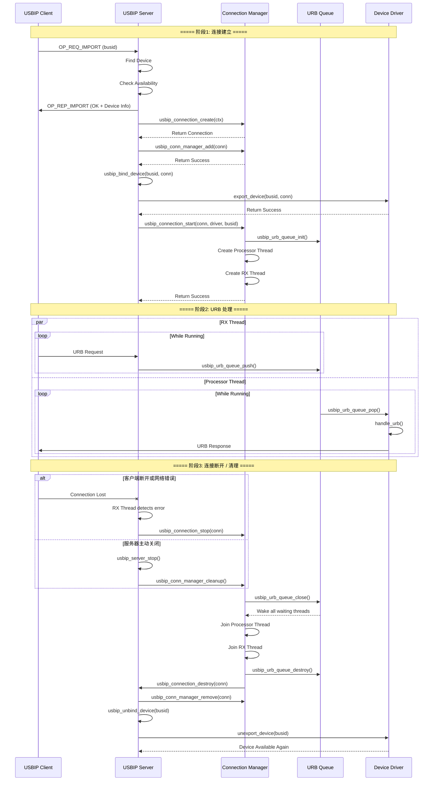

## 9. 关键数据结构关系

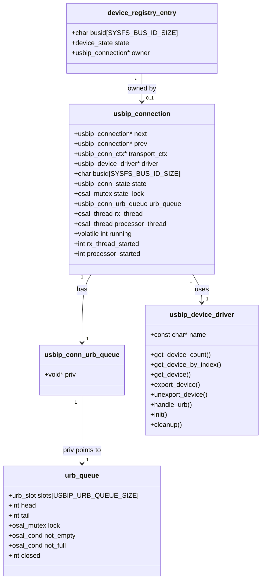

## 10. 线程模型

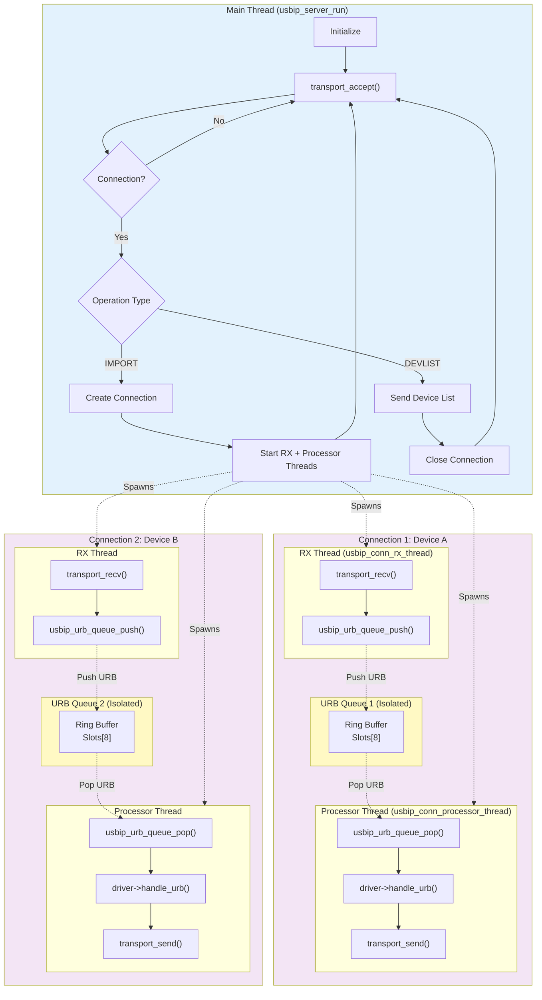

## 11. 系统生命周期（启动 → 运行 → 关闭）

```mermaid
flowchart TB
    subgraph Startup["▶️ 系统启动阶段"]
        direction TB
        ST1["程序启动"] --> ST2["Driver Auto-Register<br/>__attribute__((constructor))"]
        ST2 --> ST3["hid_dap_driver_register()"]
        ST2 --> ST4["bulk_dap_driver_register()"]
        ST3 --> ST5["usbip_server_init()"]
        ST4 --> ST5
        ST5 --> ST6["usbip_conn_manager_init()<br/>初始化连接管理器"]
        ST6 --> ST7["transport_listen()<br/>启动监听端口"]
        ST7 --> ST8["Server Ready ✓"]
    end

    subgraph Runtime["⏯️ 运行阶段"]
        direction TB
        RT1["usbip_server_run()"] --> RT2["transport_accept()"]
        RT2 --> RT3{"Import Request?"}
        RT3 -->|Yes| RT4["创建 Connection"]
        RT3 -->|No| RT5["处理其他请求"]
        RT5 --> RT1
        RT4 --> RT6["启动 RX + Processor 线程"]
        RT6 --> RT1
        
        subgraph Conn1_Runtime["Connection 1 运行中"]
            C1R1["RX: 接收 URB"] --> C1R2["Queue: Push"]
            C1R3["Queue: Pop"] --> C1R4["Processor: 处理 URB"]
            C1R5["Processor: 发送响应"]
        end
        
        subgraph Conn2_Runtime["Connection 2 运行中"]
            C2R1["RX: 接收 URB"] --> C2R2["Queue: Push"]
            C2R3["Queue: Pop"] --> C2R4["Processor: 处理 URB"]
            C2R5["Processor: 发送响应"]
        end
        
        RT6 -.->|Activates| Conn1_Runtime
        RT6 -.->|Activates| Conn2_Runtime
    end

    subgraph Shutdown["⏹️ 系统关闭阶段"]
        direction TB
        SH1["usbip_server_stop()<br/>设置 running = 0"] --> SH2["usbip_server_cleanup()"]
        SH2 --> SH3["usbip_conn_manager_cleanup()"]
        SH3 --> SH4["遍历所有连接"]
        SH4 --> SH5["usbip_connection_stop()"]
        SH5 --> SH6["关闭 URB Queue<br/>唤醒等待线程"]
        SH6 --> SH7["Join RX Thread"]
        SH7 --> SH8["Join Processor Thread"]
        SH8 --> SH9["usbip_connection_destroy()"]
        SH9 --> SH10["transport_destroy()"]
        SH10 --> SH11["Cleanup Complete ✓"]
    end

    ST8 --> RT1
    
    %% 进入关闭阶段的触发条件
    RT1 -.->|1. SIGINT/SIGTERM<br/>2. usbip_server_stop() called| SH1
    Conn1_Runtime -.->|RX/Processor Thread Exit| SH3
    Conn2_Runtime -.->|RX/Processor Thread Exit| SH3
    
    style Startup fill:#e8f5e9
    style Runtime fill:#e3f2fd
    style Shutdown fill:#ffebee
    style Conn1_Runtime fill:#f3e5f5
    style Conn2_Runtime fill:#f3e5f5
```

---

## 清理阶段（阶段5）触发条件总结

清理阶段（CleanupPhase）在以下三种情况下被触发：

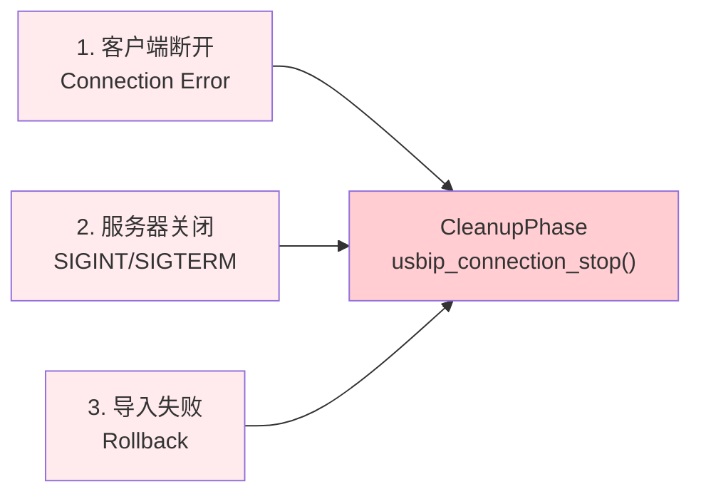

### 触发条件详情

| 触发条件 | 入口函数 | 触发点 | 清理范围 |
|---------|---------|--------|---------|
| **客户端断开** | `usbip_connection_stop()` | RX/Processor 线程检测到连接错误 | 单个连接 |
| **服务器关闭** | `usbip_conn_manager_cleanup()` | `usbip_server_stop()` 被调用 | 所有连接 |
| **导入失败回滚** | `usbip_connection_destroy()` | `export_device()` 或 `connection_start()` 失败 | 部分创建的连接 |

### 清理流程执行顺序

```
1. usbip_connection_stop()
   └── 设置 running = 0
   └── 关闭 URB Queue (唤醒等待线程)
   └── Join Processor Thread
   └── Join RX Thread
   └── 销毁 URB Queue
   └── 状态 = CONN_STATE_CLOSED

2. usbip_connection_destroy()
   └── 从连接管理器移除
   └── 关闭 Transport Context
   └── 释放内存

3. usbip_unbind_device()
   └── 解绑设备与连接
   └── 设备状态 = AVAILABLE

4. driver->unexport_device()
   └── 驱动清理
   └── 设备可再次被导入
```

---

**说明：**

1. **多客户端支持**：每个设备连接有独立的 RX 和 Processor 线程，互不干扰
2. **线程安全**：连接管理器列表和设备注册表使用互斥锁保护
3. **优雅关闭**：通过 `running` 标志和队列关闭机制确保线程安全退出
4. **资源隔离**：每连接独立的 URB 队列防止一个客户端影响其他客户端
5. **正确的初始化顺序**：`usbip_conn_manager_init()` 在 `transport_listen()` 之前调用
6. **完整的清理路径**：所有创建阶段的资源都有对应的释放路径，确保无内存泄漏
